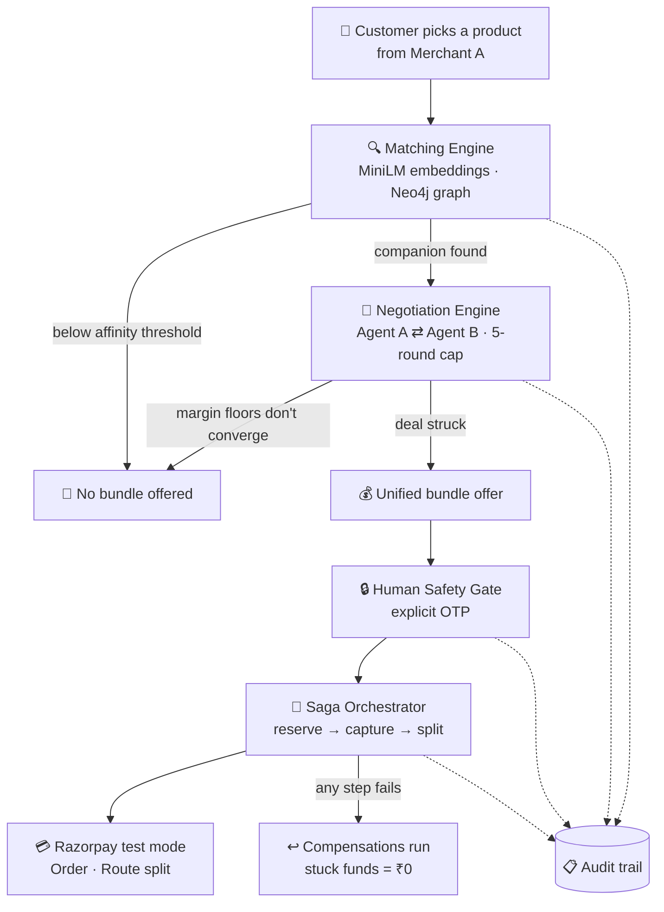

<div align="center">

<br/>
<p align="center">
  
  
  
  
  
</p>
<p align="center">
  
  
  
  
</p>
<p align="center">
  
  &nbsp;
  
  &nbsp;
  
  &nbsp;
  
</p>
<br/>
### 🔗 Semantic Matching &nbsp;·&nbsp; 🤝 Agent Negotiation &nbsp;·&nbsp; 🔒 Human Safety Gate &nbsp;·&nbsp; 🔁 Saga Recovery
 
<br/>
<p align="center">
  <a href="https://coalition-engine-beryl.vercel.app"></a>
  <a href="https://coalition-engine.onrender.com/docs"></a>
</p>
</div>
<br/>
---
 
## 💡 What is Coalition Engine?
 
> **A customer buying a laptop is a perfect customer for a bag merchant. Both merchants know this. Neither can act on it.**
 
Coalition Engine is the missing layer between two independent, non-competing merchants. A semantic engine finds which of their products genuinely belong together, their **AI agents negotiate a bundle price directly with each other**, and Razorpay splits one customer payment across both — with a saga orchestrator making sure a mid-transaction failure never strands anyone's money.
 
<table>
<tr>
<td width="50%">
**Today** ❌
- Second sale needs a second site, cart, checkout
- Most customers never bother
- Bag merchant keeps buying ads
- No way for merchants to team up in real time
</td>
<td width="50%">
**Coalition Engine** ✅
- One offer, one price, one payment
- Agents negotiate inside real margin floors
- Split settles to both merchants automatically
- Fails gracefully — never leaves funds stuck
</td>
</tr>
</table>
---
 
## 🎬 The 30-second version
 
No server. No credentials. Just run it:
 
```bash
pip install -r requirements.txt
 
python demo.py                    # 🟢 Happy path, printed stage by stage
python demo_inventory_failure.py  # 🔴 Partner stock fails — watch it degrade cleanly
python -m scripts.negotiate_demo  # 🤝 Two pairings: one closes, one legitimately can't
pytest                            # ✅ 38 tests
```
 
That third script is the one to look at. Same negotiation logic, two different pairings — one where the agents find middle ground, and one where their margin floors genuinely don't overlap, so **no bundle is offered at all**.
 
---
 
## 🔄 How a transaction actually flows
 

 
Every stage writes to a persistent audit log. `GET /audit/{correlation_id}` replays the full story of one transaction — and it's the **same log the UI reads from**, so nothing on screen is staged for the demo.
 
---
 
## ✨ Feature Highlights
 
<details>
<summary><b>🔍 Matching & Negotiation</b></summary>
<br/>
| Feature | What it does |
|---|---|
| 🧠 **Semantic Matching** | MiniLM embeddings find companions by meaning, not keywords |
| 🕸️ **Neo4j Product Graph** | Affinity relationships stored as a graph, with in-memory vector fallback |
| 🚫 **Threshold Gating** | Below the affinity bar it returns *nothing* — never forces a weak cross-sell |
| 🤝 **M2M Negotiation** | Two `MerchantAgent`s exchange bounded offers, hard-capped at 5 rounds |
| 📐 **Real Unit Economics** | Every ceiling derives from actual cost price and product role |
| 🚪 **Walk-Away Logic** | If floors can't converge, the deal dies. No manufactured fallback. |
 
</details>
<details>
<summary><b>💳 Payments & Safety</b></summary>
<br/>
| Feature | What it does |
|---|---|
| 🔒 **Human Safety Gate** | OTP required before any transfer releases — enforced via Razorpay `on_hold` |
| 💳 **Real Test-Mode Orders** | Genuine `order_...` ids, verifiable in the Razorpay dashboard |
| 🔐 **Signature Verification** | Server-side HMAC check — the browser callback is never trusted alone |
| 📐 **Bounds Validation** | Totals, splits, and margin floors validated before any API call |
| 🪝 **Webhooks** | Signature-verified server-side source of truth for payment state |
 
</details>
<details>
<summary><b>🔁 Resilience & Observability</b></summary>
<br/>
| Feature | What it does |
|---|---|
| 🔁 **Saga Pattern** | 4 steps, each with a compensating action |
| 🧯 **4 Failure Modes** | Inventory lock, Route transfer, capture, confirmation timeout |
| 💯 **₹0 Stuck, Always** | Asserted across every failure path in `tests/test_saga.py` |
| 📋 **Full Audit Trail** | `actor`, `inputs`, `decision`, `reasoning` — persisted per event |
| 🎛️ **Failure Simulator** | Toggle any failure live in the UI and watch compensations run |
 
</details>
---
 
## 📐 Bundle Economics — the part worth arguing about
 
Discount ceilings come from **unit economics**, not a config constant.
 
<div align="center">
| Role | Example | Typical margin | Discount ceiling |
|:---:|:---:|:---:|:---:|
| 🎯 **Anchor** | Laptop | 6–15% | **1–3%** |
| 🎒 **Companion** | Bag, sleeve, accessory | 40–60% | **20–40%** |
 
</div>
An anchor drives the purchase on thin competitive margins. A companion rides the anchor's traffic with far more headroom. **They cannot share a discount ceiling** — their economics aren't comparable.
 
> ⚠️ This wasn't the first design. An early version applied one shared percentage to both legs, and produced a bundle where **Merchant A absorbed ~₹10,000 of discount to move a ₹1,299 sleeve.** Economically inverted — no retailer on earth agrees to that. Replacing the shared constant with per-product margin derivation is what makes the negotiated outcomes defensible.
 
Because the floors are real, **some pairings genuinely cannot close.** Both sides concede to maximum, it still fails the viability bar, negotiation terminates, no offer shown. Same formula that produces successful bundles, hitting a real wall. `Scenario 2` in `scripts/negotiate_demo.py` demonstrates it.
 
---
 
## 🤖 Where I deliberately did *not* use AI
 
Two decisions, both load-bearing:
 
**🚫 No language model ever computes a rupee.**  
`app/agents/money.py` and `app/agents/economics.py` are pure, unit-tested arithmetic. The only model call in the entire payment path is `app/agents/copy.py`, which writes the customer-facing sentence **after** the deal is fully decided. It narrates a number the rules engine produced — it never originates one. Any proposal that would breach a margin floor is rejected by the engine, and the rejection is logged.
 
**🤫 The matcher prefers silence to a weak result.**  
Below the affinity threshold, no bundle at all. Try the **LumenView 27 4K Monitor** in the storefront — it shows as unavailable, and that's not a stock problem. It's the matcher admitting nothing in the partner catalog genuinely belongs beside it.
 
---
 
## 🧯 When things break
 
<div align="center">
| Failure mode | What the system does |
|---|---|
| 📦 Partner inventory lock fails | Degrades to the fulfillable leg — customer charged only for what ships |
| 🔀 Route transfer fails | Retries with exponential backoff, then compensates fully |
| 💳 Payment capture fails | Reservations released, nothing charged |
| ⏱️ Confirmation times out | Held reservations released, no settlement |
 
</div>
A naive implementation does one of two bad things here — kills the whole order so the customer loses a laptop they wanted, or charges for a bag that never ships. **This does neither.** Every path ends with zero funds in an indeterminate state, asserted in the test suite.
 
---
 
## 🛠️ Tech Stack
 
<div align="center">
| Layer | Technology | Purpose |
|---|---|---|
| 🐍 Backend | Python · FastAPI · Pydantic v2 | Typed API and orchestration |
| 🧠 Matching | sentence-transformers (all-MiniLM-L6-v2) | Semantic product affinity |
| 🕸️ Graph | Neo4j *(optional)* | Product relationship traversal |
| 💳 Payments | Razorpay SDK — Orders · Checkout · Route | Test-mode transactions and splits |
| 🗄️ Persistence | SQLite | Audit log and saga state |
| ⚛️ Frontend | React 18 · Vite · Tailwind · Framer Motion | 5-screen UI |
 
</div>
---
 
## 🚀 Getting Started
 
### Prerequisites
 
- **Python** 3.10+
- **Node.js** v18 or higher
- **Neo4j** *(optional — falls back to in-memory vectors)*
### Local Setup
 
```bash
# 1. Clone
git clone https://github.com/rohan1460/Coalition-Engine.git
cd Coalition-Engine
 
# 2. Backend
python -m venv .venv && source .venv/bin/activate
pip install -r requirements.txt
cp .env.example .env
 
# 3. Run the API — port 8000
uvicorn app.main:app --reload
 
# 4. In a second terminal, run the UI — port 5173
cd frontend && npm install && npm run dev
```
 
Open **http://localhost:5173** · Swagger docs at **http://localhost:8000/docs**
 
### 💳 Enable Live Razorpay Test Transactions
 
| Step | Action |
|---|---|
| 1 | Get test keys from your [Razorpay Dashboard](https://dashboard.razorpay.com) (Test Mode) |
| 2 | Add `rzp_test_` credentials to `.env` |
| 3 | Start the API with `USE_REAL_RAZORPAY=true uvicorn app.main:app --reload` |
| 4 | Verify anytime — `python -m scripts.route_spike` prints a real `order_` id |
 
---
 
## 📡 API Surface
 
| Method | Endpoint | Description |
|:---:|---|---|
| `GET` | `/health` | Service and dependency status |
| `GET` | `/catalog` | Merchant A storefront, with `has_companion` per product |
| `POST` | `/checkout/initiate` | Match → negotiate → bundle offer, or none |
| `POST` | `/checkout/confirm` | Validate OTP → reserve inventory → create order |
| `POST` | `/checkout/pay` | Server-side signature verification → release split |
| `POST` | `/checkout/simulate` | Run a checkout with a forced failure mode |
| `GET` | `/audit/{correlation_id}` | Complete ordered story of one transaction |
| `POST` | `/webhooks/razorpay` | Signature-verified payment source of truth |
 
---
 
## 📂 Project Structure
 
```
Coalition-Engine/
│
├── app/
│   ├── agents/          # 🤝 MerchantAgent, negotiation engine
│   │   ├── economics.py #    Margin floors, role-based ceilings
│   │   ├── money.py     #    Pure arithmetic — no LLM, ever
│   │   └── copy.py      #    The one model call: offer copy, post-decision
│   │
│   ├── matching/        # 🔍 Embeddings, Neo4j graph, catalog loading
│   ├── payments/        # 💳 Razorpay client, bounds validation, settlement
│   ├── checkout/        # 🔗 End-to-end orchestration
│   ├── saga/            # 🔁 Steps, compensations, retry with backoff
│   ├── audit/           # 📋 Structured persistent trail
│   ├── models/          # 📐 Pydantic schemas
│   └── api/             # 📡 FastAPI routes
│
├── data/                # Merchant catalogs — Flipkart-derived pricing
├── frontend/            # ⚛️ React UI — 5 screens
├── scripts/             # negotiate_demo · matching_sanity · load_graph · route_spike
├── tests/               # ✅ 38 tests
│
├── demo.py                    # Scripted happy path
└── demo_inventory_failure.py  # Scripted failure path
```
 
---
 
## ⚠️ Known Limitations
 
> **Route transfers are simulated over a real order.**  
> Route requires KYC activation on the merchant account, which couldn't be provisioned inside the build window. The production path — `on_hold` transfers with a `PATCH` release — is fully implemented and tested against the mock client. Setting `ROUTE_ENABLED=true` once activation clears requires **no code changes**. The UI explicitly labels the simulated leg rather than presenting it as a completed transfer.
 
> **Neo4j is optional by design.**  
> If the graph is unreachable, matching falls back to the in-memory vector matcher with a logged warning. That's intentional resilience — but multi-hop coalition traversal only runs when Neo4j is up.
 
---
 

 
---
 
<div align="center">

**Built by [Rohan](https://github.com/rohan1460) for the Razorpay AI Buildathon**
 
*Test mode only. No real funds move at any point.*
 
<br/>
⭐ **If this was interesting, a star helps.** ⭐
 
</div>
